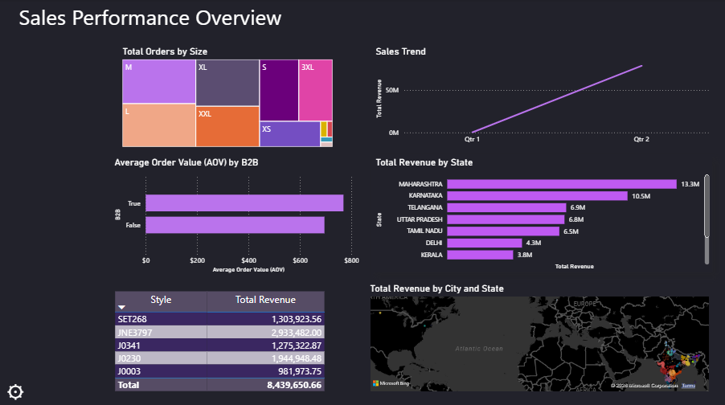

# Sales Performance Overview

**Project Description** 
Developed a high-impact, single-page business intelligence tool to analyze $8.4M in total revenue from Amazon merchant data.  This dashboard provides a "Command Center" for executives to monitor growth, regional performance, and inventory health in real-time.

**Tools Used**
- **Data Sourcing:** Kaggle (Amazon India Sales Dataset)
- **Data Cleaning & ETL:** Power Query (M Language)
- **Analysis & Modeling:** Power BI Desktop, DAX (Data Analysis Expressions)
- **Visualization:** Power BI (Custom Dark Mode UI, Bookmarks, and Selection Panes for dynamic navigation)

**Technical Highlights**
| Components | Description |
| :---: | :---: |
| Data Modeling | Established a robust schema including a custom Date Table for time-intelligence analysis. |
| Advanced Analytics (DAX) | Authored measures for Total Revenue, Total Orders, and Average Order Value (AOV). |
| UI/UX Design | Implemented a Slide-out Filter Menu using Bookmarks and the Selection Pane to maximize report "real estate" |
| Geo-Spatial Mapping | Visualized regional sales density to identify Maharashtra as the top revenue-generating state. |

**Key Business Insight**
- **Product Performance:** Identified Style JNE3797 as the lead revenue driver ($2.9M).
- **Size Optimization:** Discovered that M and L sizes account for the highest order volume, guiding future inventory procurement.
- **Logistics Analysis:** Balanced fulfillment tracking between Amazon FBA and Easy Ship to monitor operational efficiency.

**Power BI Dasboard** 
| Open Filter Menu | Close Filter Menu |
| :---: | :---: |
|  |  |
